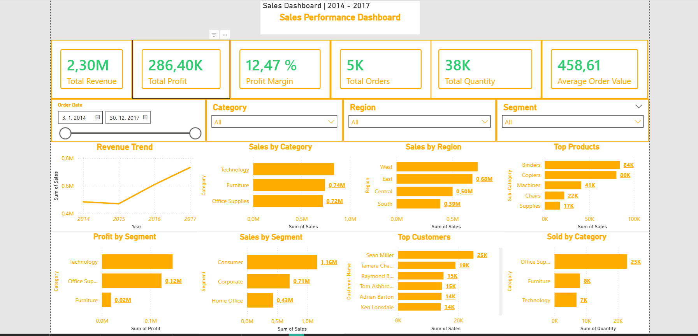
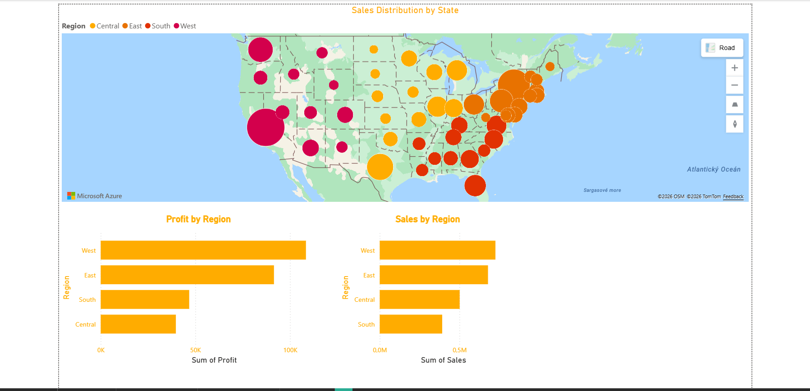

# Sales Performance Dashboard – Power BI

This project demonstrates how business intelligence dashboards can help monitor company sales performance.

## Dataset
Superstore Sales Dataset (2014–2017)

## Tools
- Power BI
- DAX
- Data Visualization

## Business Questions
- How much revenue did the company generate?
- Which categories perform best?
- Which regions drive the most profit?
- How does revenue evolve over time?

## Dashboard Features
- KPI cards (Revenue, Profit, Orders, Quantity)
- Sales trend analysis
- Category performance
- Regional analysis
- Top products and customers
- Geographic sales distribution
- ## Dashboard Preview

## Geographic Analysis

